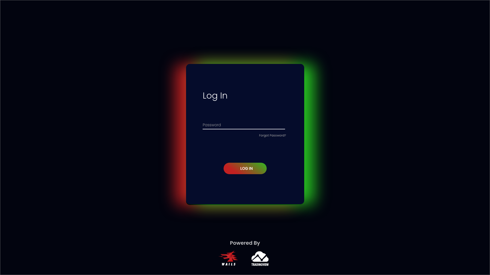
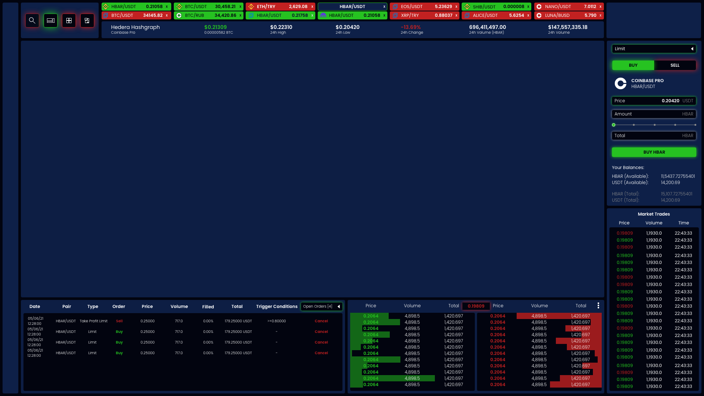

# Raverte

### Trade Crypto across multiple exchanges with open source software you can trust. 

 
 

### **What is Raverte?**

Raverte is a native trading client written in Go, with a binding engine made by **[WAILS](https://github.com/wailsapp/wails)** and charting libraries provided by **[TradingView](https://www.tradingview.com).** There is no sign up and all data required by the application is stored locally. Raverte was initially going to a private venture, however, I do not have the time I'd like to dedicate to the project; which I thought was a shame, therefore I decided to make it open source and welcome all the help people are willing to offer. Due to the shift from private to open source, alot of the code I have will need to be re-written. *The new code can be found on the dev branch.*

 

### **What are the main features?**
- Buy & Sell crypto.
- Support for the main exchanges.
- Account (exchange specific) summaries.
- Trade summaries.
- Multi-chart view.

 

### **Is there any nice to haves but wont be included in the first release?**
- Native trading bot integration.
- Mobile app.

 

### **What about my API Keys?**

If you choose to use Raverte to buy/sell crypto you will be requried to store your API Keys locally, which will be encrypted locally with a password you will use to login. The password will be unrecoverable in the event you forget it, in which case you will need to generate some new API Keys.

  

### **So, what did you have before?**

Here are some wireframes I made early on, I do have these coded and functioning (including a chart) for Binance, but as stated above this code will need to be re-written, so watch this space...

 

 

### **How can I help?**

- **Graphics** 
    - If you're good with graphics, get in touch, I suck at creating them.
- If you're comfortable with Go, get in touch.
- JS & CSS witches & wizards make yourselves heard... 
- Give some love to **[WAILS](https://github.com/wailsapp/wails)**.

 

   
   
     
 

   <b><i>website coming soon.</i></b>

